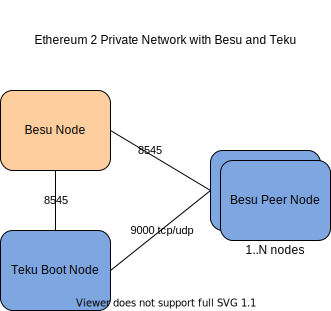

# Teku Private Network

This repository contains code to provision a Ethereum client Teku private network in AWS environment. 
Private network consist of one node Ethereum 1 network using Besu client, single Teku boot node and
any number of Teku peer-nodes.

Besu node is created with Gensis file. Genesis file includes few accounts with large amount of ether and a contract to
to deposit 32 ethers for validator registration.

Besu client starts first to form the ethereum 1 network. Secondly Teku boot node starts referincing the ethereum 1 network.
Teku requires Ethereum version 1 client to start. Each Teku node generate validator keys (64) and register keys by depositing 32 ethers
by executing the contract. Next Teku peer nodes (N number of nodes) are started and join the network by communicating with the Teku boot node.   



#  Creating Network

AWS cloudformation template currently creates resources in a new VPC. 

Pre-requisite
- Access to AWS with sufficient priviledge to create vpc, subnet, nacl, security-groups, ec2, autoscaling group
- API access and aws cli configured
- Name of the ssh key for EC2 instances

```bash
aws cloudformation create-stack \
  --stack-name <name for cloud formation stack> \
  --template-body file://cfn-teku-network.yaml \
  --parameters ParameterKey=Owner,ParameterValue=<owner name> \
               ParameterKey=KeyName,ParameterValue=<ssh key name>
``` 

## Cloudformation Template Parameters

Following cloudformation parameters supported.

| Parameter Key    | Default Value    | Description  |
| -------------------- |:-------------| :-----|
| BesuImageTag         | latest       | Besu docker image tag |
| BesuInstanceType     | t3.micro     | Besu can run with t3/t2 micro instance |
| Environment          | dev          | Currently only dev available |
| GitRepository        | https://github.com/ConsenSys/teku-network|   Git repository |
| GitBranch            | master       | Git branch |
| Network              | private      | Currently only private available |
| KeyName              |              | Must provide ssh key name for EC2 instances |
| Owner                |              | Must provide to set the resource owner tag |
| TekuInstanceSpotPrice| 0.05         | Teku peer nodes run with spot instances |
| TekuInstanceType     | t3.medium    | Require at least t3/t2 medium instance |
| TekuPeerNodesCount   | 1            | Number of Teku peer nodes |
| TekuPeerNodesCountMax| 5            | Max Teku peer nodes. Must increase if TekuPeerNodesCount is increased |
| TekuImageTag         | latest       | Teku docker image tag |
